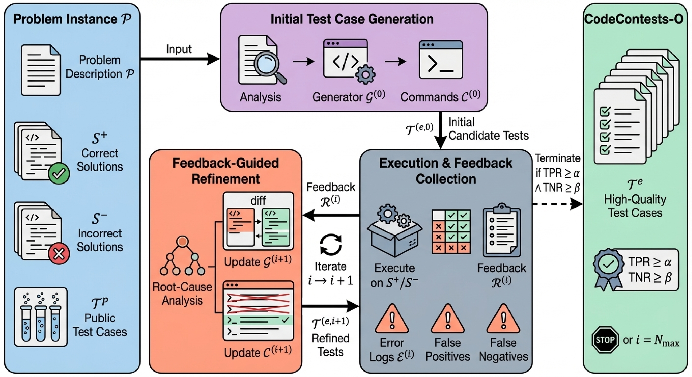

<div align="center">

# 🏆 CodeContests-O

### Feedback-Driven Iterative Test Case Generation Framework

[](https://arxiv.org/abs/2501.xxxxx)
[](https://huggingface.co/datasets/caijanfeng/CodeContests-O)
[](https://github.com/cai-jianfeng/CodeContests-O)
[](https://opensource.org/licenses/MIT)
[](https://www.python.org/downloads/)

[📄 Paper](https://arxiv.org/abs/2501.xxxxx) | [🤗 Dataset](https://huggingface.co/datasets/caijanfeng/CodeContests-O) | [💻 Code](https://github.com/cai-jianfeng/CodeContests-O)

</div>

---

## 📢 News

<!-- - **[2026.xx]** 🎉 Paper accepted to ACL 2026! -->
- **[2026.01]** 🚀 Code and dataset released!

## 📖 Overview

The rise of reasoning models necessitates large-scale verifiable data, for which programming tasks serve as an ideal source. However, while competitive programming platforms provide abundant problems and solutions, **high-quality test cases for verification remain scarce**.

**CodeContests-O** addresses this challenge with a novel **Feedback-Driven Iterative Framework**. Unlike existing approaches that rely solely on LLM's intrinsic generation capabilities, our method:

1. 🔄 Leverages execution feedback from both correct and incorrect solutions
2. 🎯 Iteratively refines test cases toward high fidelity and discriminability
3. ✨ Supports both refining existing generators and creating new ones from scratch
4. 📈 Achieves significant improvements in test case quality

<div align="center">

<br>
<em>Overview of the Feedback-Driven Iterative Framework</em>
</div>

### ✨ Key Features

| Feature | Description |
|---------|-------------|
| 🔄 **Feedback-Driven** | Utilizes execution results as feedback to guide LLM in refining test cases |
| 📊 **High Quality** | 89.37% TPR & 90.89% TNR on 11M+ solutions |
| 🚀 **Training Effective** | +9.52% improvement on LiveCodeBench after fine-tuning |
| 🛠️ **Extensible** | Easily adaptable to other competitive programming datasets |
| 🤗 **HuggingFace Ready** | Direct integration with HuggingFace Datasets |
| ✨ **Generator Flexible** | Works with existing generators or creates new ones from scratch via LLM |


### 📊 Performance Comparison

<div align="center">

| Dataset | TPR (↑) | TNR (↑) | Avg (↑) |
|:-------:|:-------:|:-------:|:-------:|
| CodeContests | 85.05% | 81.52% | 83.29% |
| CodeContests+ | 79.00% | 83.04% | 81.02% |
| **CodeContests-O (Ours)** | **89.37%** | **90.89%** | **90.13%** |

*Evaluated on 11M+ solutions from the complete solution pool*

</div>

## 🚀 Quick Start

### Installation
```bash
# Clone the repository
git clone https://github.com/cai-jianfeng/CodeContests-O.git
cd CodeContests-O

# Install dependencies
pip install -e .
```

<details>
<summary>📦 Requirements</summary>

- Python ≥ 3.8
- openai ≥ 1.0.0
- pydantic ≥ 2.0.0
- requests ≥ 2.28.0
- tqdm ≥ 4.64.0
- datasets ≥ 2.0.0

</details>

### Prerequisites

Before running the framework, you need to download `testlib.h` - a widely-used library for competitive programming test generation:
```bash
# Download testlib.h to your working directory
wget https://raw.githubusercontent.com/MikeMirzayanov/testlib/master/testlib.h

# Or using curl
curl -O https://raw.githubusercontent.com/MikeMirzayanov/testlib/master/testlib.h
```

> 💡 **Note**: `testlib.h` is required for compiling and running test case generators. Make sure it's accessible via the `--testlib_path` argument (defaults to `./testlib.h` in current directory).

For more information about testlib, visit the [official repository](https://github.com/MikeMirzayanov/testlib).

### Basic Usage

#### Option 1: From HuggingFace 🤗
```bash
python -m codecontests_o.main \
    --data_path ByteDance-Seed/Code-Contests-Plus \
    --results_dir ./results \
    --api_key $OPENAI_API_KEY \
    --sandbox_hosts localhost \
    --testlib_path ./testlib.h
```

#### Option 2: From Local JSON Files
```bash
python -m codecontests_o.main \
    --data_path /path/to/codecontests/json \
    --results_dir ./results \
    --api_key $OPENAI_API_KEY \
    --sandbox_hosts localhost \
    --testlib_path ./testlib.h
```

#### Option 3: Using Preset Configurations
```bash
# Development (low parallelism, debug mode)
python -m codecontests_o.main --preset development --data_path ./data

# Production (high parallelism)
python -m codecontests_o.main --preset production --data_path ./data

# Quick test (generate only, skip validation)
python -m codecontests_o.main --preset quick --data_path ./data
```

### Python API
```python
from codecontests_o import Config, CodeContestsReader, ParallelProcessor, get_preset_config
import base64

# 1. Setup configuration
config = Config.from_dict(get_preset_config("development"))
config.openai.api_key = "your-api-key"
config.dataset.data_path = "ByteDance-Seed/Code-Contests-Plus"
config.dataset.results_dir = "./results"

# 2. Load testlib.h
with open("testlib.h", "rb") as f:
    testlib_files = {"testlib.h": base64.b64encode(f.read()).decode()}

# 3. Create dataset reader (auto-detects HuggingFace vs local)
dataset = CodeContestsReader(data_path=config.dataset.data_path, split="test", start=0, end=10)

# 4. Run generation
processor = ParallelProcessor(config=config, testlib_files=testlib_files)
stats = processor.process_dataset(dataset, config.dataset.results_dir)

print(f"✅ Completed: {stats['completed']}/{stats['total']}")
```

## 📈 Solution Evaluation

Evaluate solution performance on existing test cases to analyze dataset quality:
```bash
# Run evaluation
python -m codecontests_o.solutions_eval \
    --data_path ByteDance-Seed/Code-Contests-Plus \
    --subset 1x \
    --results_dir ./results_eval \
    --start 0 --end 100

# Analyze results (TPR/TNR)
python -m codecontests_o.analyze_results --results_dir ./results_eval
```

<details>
<summary>📊 Metrics Explanation</summary>

| Metric | Description |
|--------|-------------|
| **TPR** (True Positive Rate) | Proportion of correct solutions identified as correct (↑ better) |
| **TNR** (True Negative Rate) | Proportion of incorrect solutions identified as incorrect (↑ better) |

</details>

## 🔧 Custom Dataset Integration

Easily integrate your own datasets by implementing the `DatasetReader` interface:
```python
from codecontests_o.data import DatasetReader, Sample, Solution, TestCase, Language

class MyDatasetReader(DatasetReader):
    def __init__(self, data_path: str, start: int = 0, end: int = -1):
        self.data_path = data_path
        self._samples = self._load_data()
    
    def _load_data(self):
        samples = []
        for item in your_data:
            sample = Sample(
                id=item['id'],
                name=item['name'],
                description=item['description'],
                # Optional: C++ generator using testlib.h
                # - If provided: framework iteratively refines it based on feedback
                # - If None: framework generates a new generator from scratch using LLM
                generator=item.get('generator_code'),
                canonical_solutions=[Solution(code=item['solution'], language=Language.PYTHON)],
                correct_solutions=[Solution(code=item['solution'], language=Language.PYTHON)],
                incorrect_solutions=[Solution(code=item['wrong_solution'], language=Language.PYTHON)],
            )
            samples.append(sample)
        return samples
    
    def __iter__(self):
        yield from self._samples
    
    def __len__(self):
        return len(self._samples)
    
    @property
    def name(self):
        return "MyDataset"
```
```bash
python -m codecontests_o.main --custom_reader my_reader.py --data_path /path/to/data
```

## ⚙️ Configuration

<details>
<summary>🤖 OpenAI Configuration</summary>

| Option | Default | Description |
|--------|---------|-------------|
| `api_base` | `https://api.openai.com/v1` | API base URL |
| `api_key` | - | API key |
| `model` | `gpt-4o` | Model name |
| `max_tokens` | `8000` | Maximum tokens |

</details>

<details>
<summary>🖥️ Sandbox Configuration</summary>

| Option | Default | Description |
|--------|---------|-------------|
| `hosts` | `["localhost"]` | Sandbox hosts |
| `base_port` | `8080` | Base port |
| `port_range` | `4` | Ports per host |
| `compile_timeout` | `20` | Compilation timeout (s) |
| `run_timeout` | `20` | Execution timeout (s) |

</details>

<details>
<summary>⚡ Processing Configuration</summary>

| Option | Default | Description |
|--------|---------|-------------|
| `max_iterations` | `3` | Max iterations per sample |
| `sample_level_workers` | `4` | Sample-level parallelism |
| `output_generation_workers` | `4` | Output generation parallelism |
| `solution_validation_workers` | `4` | Validation parallelism |

</details>

## 📁 Project Structure

<details>
<summary>Click to expand</summary>

```
codecontests_o/
├── pyproject.toml              # Build configuration
├── setup.py                    # Installation script
├── src/codecontests_o/         # Source code
│   ├── main.py                 # Main entry point
│   ├── solutions_eval.py       # Solution evaluation
│   ├── analyze_results.py      # Result analysis
│   ├── config/                 # Configuration management
│   ├── data/                   # Data processing & readers
│   ├── clients/                # OpenAI & Sandbox clients
│   ├── core/                   # Generator & Validator
│   ├── parallel/               # Parallel processing
│   ├── prompts/                # LLM prompt templates
│   └── utils/                  # Utilities & logging
└── README.md
```

</details>

## 📝 Citation

If you find this work useful, please cite our paper:
```bibtex
@article{cai2025codecontestso,
  title={CodeContests-O: A Feedback-Driven Iterative Framework for Test Case Generation},
  author={Cai, Jianfeng and others},
  journal={arXiv preprint arXiv:2501.xxxxx},
  year={2025}
}
```

## 🙏 Acknowledgements

- [CodeContests](https://arxiv.org/abs/2203.07814) by DeepMind and [CodeContests+](https://arxiv.org/abs/2506.05817) by ByteDance.
- [testlib.h](https://github.com/MikeMirzayanov/testlib) by Mike Mirzayanov

## 📬 Contact

For questions or issues, please:
- 📧 Open an [Issue](https://github.com/cai-jianfeng/CodeContests-O/issues)
- ⭐ Star this repo if you find it helpful!

---

<div align="center">

**[⬆ Back to Top](#-codecontests-o)**

</div>